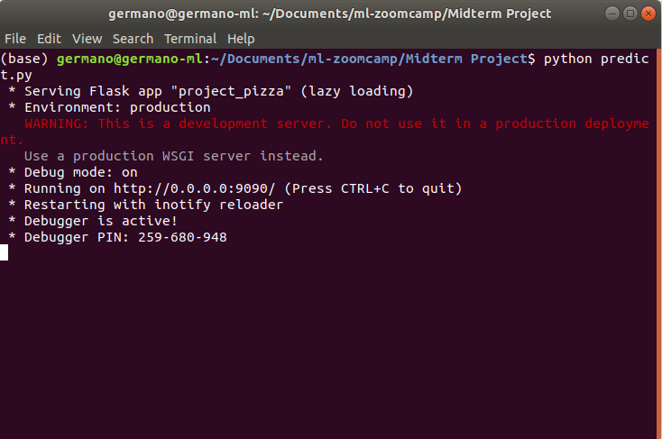
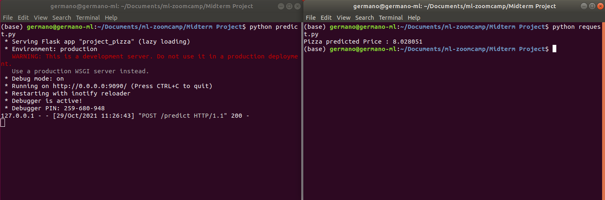
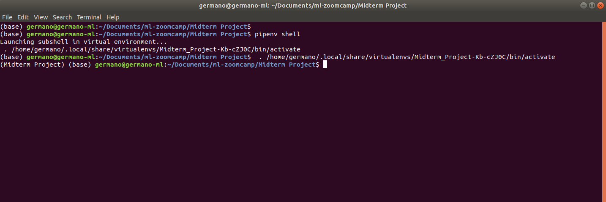
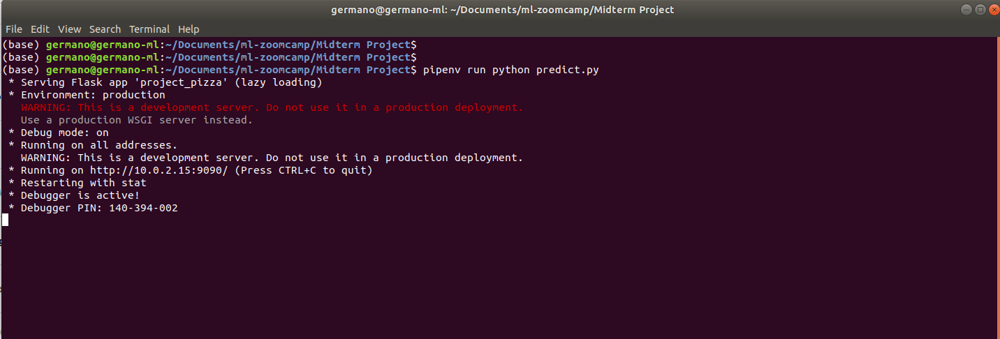
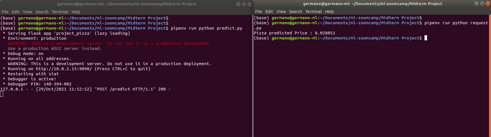
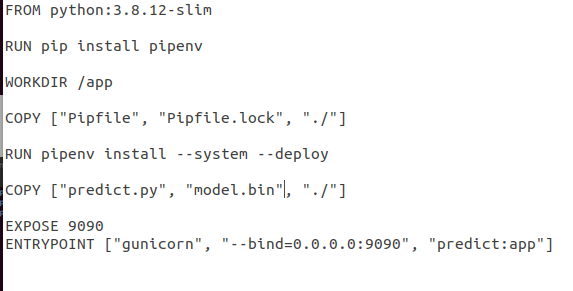
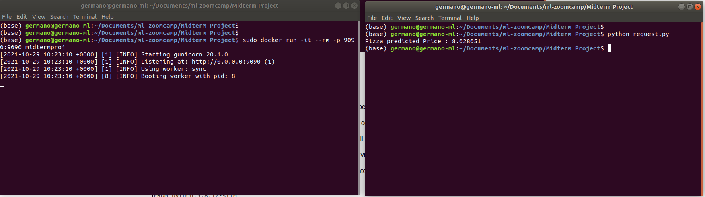

# ML Midterm Project - Pizza Price Prediction

# Summary
1. Problem Description
2. EDA
3. Model Training
4. Exporting notebook to script
5. Model deployment
6. Dependency and enviroment management
7. Containerization

## Package Files description
This package contain the following files:
1. notebook.ipynb: The jupiter notebook with the Analysis, EDA, best model determination etc.
2. Pipfile and Pipfile.lock: Pipenv files
3. Dockerfile: Docker configuration file
4. train.py: the notebook exported file in python and transformed in order to generate di model
5. model.bin: model and DictVectorize
6. predict.py: the service whic receive the request of price prediction
7. request: the request of price determination. Invoke the service and sent the POST request.
8. Pizza-Price.csv: the dataset from Kaggle
9. README.md: this file with instruction.
10. Screenshots Folder: contain the screenshot included in README.md file

## 1. Problem Description
This dataset for beginners for practice:
	https://www.kaggle.com/alyeasin/predict-pizza-price

I used this dataset data in order to build a model for pizza price predictions.
Dataset Columns Decription:
1. Restaurant: Restaurant Id-Name (categorical variable - String)
2. Extra Cheese (categorical variable - Yes/No)
3. Extra Mushroom (categorical variable - Yes/No)
4. Size by Inch (numerical variable - Int - How big the pizza is)
5. Extra Spicy (categorical variable - Yes/No)
6. Price (numerical and target variable, Int, the price was specified in Taka value, during the exercise I convert the price in Euro and set the variable type to Float)

## 2. EDA
I did the following steps:
1. Check Columns type
2. Check null and duplicated values
3. Check and clean format: substitute space char with _ and fix 'size_by_inch' field space at the start
4. Convert price from Int64 Taka to Float32 Euro value (1 Taka = 0.010 Euro)
5. Numerical feature correlation: 'size_by_inc' scored 0.68 to price
6. Plot the price values and since the moment isnt' a 'long tail distribution' but normal distribution I don't apply log function to the price
7. Check mutual_info_score among categorical features: 
	* restaurant        2.016154
	* extra_spicy       0.384718
	* extra_mushroom    0.249549
	* extra_cheeze      0.178636

## 3. Model Training
1. Subdivide the dataset to 60-20-20 (train, val, test) using scikit-learn libraries
2. Prepare target value arrays
3. Remove target value 'price' from the datasets
4. Use DictVectorize for generate 'hot-encoded' features matrixes
5. Train the following models on train and finally full_train dataset (train + val datasets):
	* Linear Regression
	* Ridge Regression (for some alpha values)
	* SGD Regressor
	* SVR Regressor
	* Random Forest Regressor
	* Decision Tree Regressor
	* Xgboost Tree Regressor (Tuning eta, max_depth and max_child_weight parameters)
6. For each models, I check the best RMSE values:
	* 'Linear Regression RMSE=': 0.8717005362328303,
 	* 'Ridge Regression (alpha 3) RMSE=': 0.5138463543966755,
 	* 'SGDRegressor RMSE=': 1.1782828316062282,
 	* 'SVR RMSE=': 0.4238536795607311,
 	* 'RandomForestRegressor RMSE=': 0.769604971722506,
 	* 'DecisionTreeRegressor RMSE=': 0.769604971722506,
	* 'XgboostRegressor RMSE=': 0.41614005
  
	XgboostRegressor was the model with the best RMSE

## 4. Exporting notebook to script
The Jupiter Notebook was exported in Python.
Prepare the train.py script.
Train.py script read the dataset csv file, train the selected model with full_train dataset and export model and dv in .bin file.

## 5. Model deployment
Once the model.bin is exported and ready to be used, I prepare two scripts and tested it with flask.
The scripts are:
* request.py
* predict.py

#### Request.py

>url = 'http://localhost:9090/predict'

>pizza_id = 'project-pizza'
>pizza = {'restaurant': 'B',
> 'extra_cheeze': 'no',
> 'extra_mushroom': 'yes',
> 'size_by_inch': 15,
> 'extra_spicy': 'yes'}

>response = requests.post(url, json=pizza).json()

>print('Pizza predicted Price : %f' % response['price'])

Data are encapsulated with json and sent to the service (predict.py)

#### Predict.py 
Manage the service (/predict) and use the model to predict the pizza (sent by POST method and encapsulate with json) price.

#### Flask test
1. Run predict.py script

2. Run request.py script

## 6. Dependency and enviroment management
#### Prepare the Virtual Environment with PIPENV

1. Command: pipenv install numpy pandas scikit-learn==0.24.1 xgboost flask gunicorn requests

#### Access or execute scripts from the Virtual Env

1. Command to access: pipenv shell

 

2. Command to execute a command: pipenv cmd

Example launch predict.py from pipenv

pipenv run python predict.py

 

Example launch request.py from pipenv

pipenv run python request.py

 

## 7. Containerization
Create a Docker container with the following steps:

1. sudo docker pull python:3.8.12-slim -> This command download a Docker container with python version 3.8 slim

2. sudo docker run -it --rm --entrypoint=bash python:3.8.12-slim -> This command allow to access to the docker container vm

3. mkdir app -> create the app directory in the docker vm. This folder will contain the model.bin

4. sudo docker build -t midtermproj . -> This command build the docker vm (called midtermproj) with the docker file

	The dockerfile copy the pipfiles, predict.py script and the model.bin into the app folder, install the necessary package using pipfiles, starts the service with gunicorn on port 9090

5. sudo docker run -it --rm -p 9090:9090 midtermproj -> This command starts the service

6. python request.py -> You can test the services sending a pizza price evaluation

 

 
