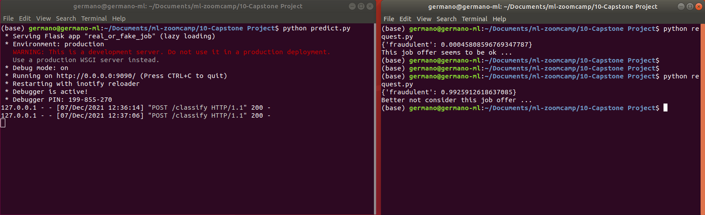
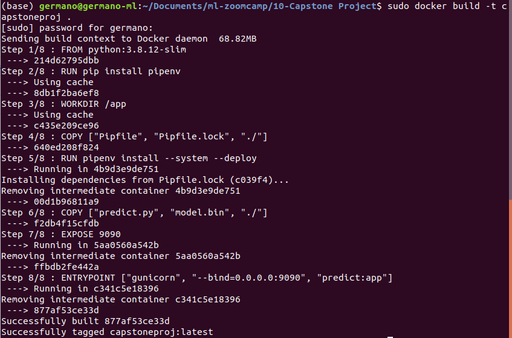
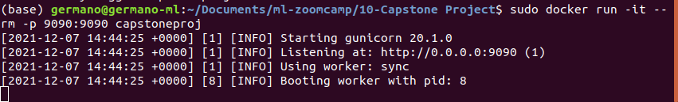
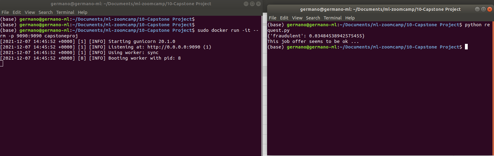

# ML Capstone Project - Fraudulent Job Classification

# Summary
1. Problem Description
2. EDA
3. Dataset preparation
4. Model Testing Training
5. Evaluating models score and train the final model
6. Exporting notebook to script
7. Model deployment and test with Flask
8. Dependency and enviroment management
9. Containerization

## Package Files description
This package contain the following files:
1. capstone_notebook.ipynb: The jupiter notebook with the Analysis, EDA, tested models, tuning and training
2. Pipfile and Pipfile.lock: Pipenv files for the virtual environment
3. Dockerfile: Docker configuration file
4. train.py: the python script responsible for training and generate the model.bin
5. model.bin: model and DictVectorize
6. predict.py: the service which receive a job post object and determine if it's a fraudulent job or not
7. request: It's the job post request of classification. Input of our model. Invoke the service and sent the POST request.
8. fake_job_postings.zip: the dataset from Kaggle (compressed)
9. README.md: this file with the instruction.
10. Screenshots Folder: contain the screenshot included in README.md file

## 1. Problem Description
Here the link of the dataset:
	https://www.kaggle.com/shivamb/real-or-fake-fake-jobposting-prediction

The goal is to buil a model who receive a job post and classify it as fraudulent or not fraudulent.
Last time I tried a linear regression exercise, this time I want to try a classification one (binary classification).
Dataset Columns Decription:
1. job_id                 Unique Job ID
2. title                  The title of the job entry.
3. location               Geographical location of the job
4. department             Corporate department 
5. salary_range           Indicative salary range
6. company_profile        Company description
7. description            Description of the job
8. requirements           Requirements for the job position
9. benefits               Benefits offered
10. telecommuting          Telecommuting positions Bool
11. has_company_logo       Company logo Bool
12. has_questions          Questions Bool
13. employment_type        Full-type, Part-time, Contract, etc.
14. required_experience    Executive, Entry level, Intern, etc.
15. required_education     Doctorate, Master’s Degree, Bachelor, etc.
16. industry               Automotive, IT, Health care, Real estate, etc
17. function               Consulting, Engineering, Research, Sales etc.
18. fraudulent             Target variable Bool

## 2. EDA
I perform the following steps:
1. Check the data in order to find null values
2. Remove job_id field: unnecessary for the training. It can't help for the classification
3. I was insecure how to treat some very descriptive field. At the end I opt to:
	* for location, department and salary_range, I create a new field that contain only one information: available or not_available
	* for very descriptive field such as company_profile, description, requirements, benefits, title I did the same thing of the step above, but I add a new field for both of them that contain the lenght of the field
	* proceed examining the other field and replace null values with not_available information
	* columns name were ok
	* Replace spaces with _ string if necessary
4. Numerical variables correlation: If the Company has a logo and a good profile description better is
	* telecommuting             0.034523
	* has_company_logo         -0.261971
	* has_questions            -0.091627
	* company_profile_lenght   -0.155065
	* description_lenght       -0.015927
	* requirements_lenght      -0.053013
	* benefits_lenght           0.002209
	* title_lenght              0.034741
5. Categorical variables mutual information
	* industry                     0.031548
	* company_profile_available    0.030207
	* function                     0.013993
	* required_education           0.008147
	* required_experience          0.003952
	* employment_type              0.002678
	* salary_range_available       0.001571
	* description_available        0.000169
	* requirements_available       0.000140
	* department_available         0.000117
	* benefits_available           0.000031
	* location_available           0.000009

## 3. Dataset preparation
1. Subdivide the dataset to 60-20-20 (train, val, test) using scikit-learn libraries
2. Full train set composed by train and val together
3. Prepare target value arrays
3. Remove target value 'fruadulent' from the datasets
4. Use DictVectorize for generate 'hot-encoded' features matrixes

## 4. Model Testing Training
1. I tested the following models, training them on train/val dataset
	* Logistic Regression
	* Kfold Cross Validation
	* Decision Tree Classifier (Tuning max_depth and max_child_weight parameters)
	* Random Forest (Tuning max_depth and max_child_weight parameters)
	* Xgboost Tree(Tuning eta, max_depth and max_child_weight parameters)

2. For each one I collected roc_auc_score, confusion_map and precision_recall scores
3. For confusion_map and precision_recall scores I prepare some functions in order to have a tidy notebook sheet

## 5. Evaluating models score and train the final model
Here a recap of how the models performed:
1. Logistic Regression:
	* roc_auc_score: 0.85
	* confusion_map: [[0.95, 0.  ], [0.04, 0.01]]
	* precision and recall: 0.78 and 0.17
2. Kfold Cross Validation:
	* roc_auc_score: 0.89
	* confusion_map: [[0.95, 0.  ], [0.04, 0.01]]
	* precision and recall: 0.78 and 0.17
3. Decision Tree Classifier (after tuning)
	* roc_auc_score: 0.91
	* confusion_map: [[0.94 0.], [0.03 0.02]]
	* precision and recall: 0.82 and 0.33
4. Random Forest Classifier (after tuning)
	* roc_auc_score: 0.97
	* confusion_map: [[0.95 0.], [0.03 0.02]]
	* precision and recall: 1 and 0.46
5. XgBoost Binary Logistic (after tuning)
	* roc_auc_score: 0.98
	* confusion_map: [[0.95 0.], [0.02 0.03]]
	* precision and recall: 0.93 and 0.66

6. XgBoost Binary Logistic (on full_train_dataset and after tuning)
	* roc_auc_score: 0.98
	* confusion_map: [[0.95 0.], [0.01 0.04]]
	* precision and recall: 0.93 and 0.74

## 6. Exporting notebook to script
The Jupiter Notebook was exported in Python.
Built train.py script.
Train_model.py script read the dataset csv file, train the selected model with full_train dataset and export model and dv in .bin file.

## 7. Model deployment and test with Flask
Once I had the model.bin file, I created two script to test the model with Flask.
* predict.py
* request.py

predict.py is responsible to receive a job_post request, use the model to classify the job_post and return if the job is fraudulent or not. The debug services use Flask and stay in alert if a job_post request has submitted.

request.py is the script which send the json encapsulated job_post data by POST protocol. It gets a response from the service and display the result on screen.

Here the instructions how to test the model with Flask:

1. Train the model and produce model.bin file using train_model.py script:
	* Decompress fake_job_postings.zip (data CSV) in the same folder of the train_model.py script
	* Run the script using command: python train_model.py
	* Once done you can start the Flask service using the command: python predict.py
	* Once the service is UP, you can send a job_post classification request using the command: python request.py

	

## 8. Dependency and enviroment management
Here the part where I prepare the virtual environment.
This is the command I used: 
	pipenv install numpy pandas scikit-learn==0.24.1 xgboost flask gunicorn requests

I specified the version for scikit-learn module, xgboost for the model, flask for debug service, gunicorn for the production environment and request to manage the request transaction
This step generate the PIPENV files (Pipfile and Pipfile.lock) used in the next step to build the Docker image

## 9. Containerization
I used python:3.8.12-slim a light version with python 3.8
You can pull the image with the following command: sudo docker pull python:3.8.12-slim
And run the image with the following command: sudo docker run -it --rm --entrypoint=bash python:3.8.12-slim

I prepared a Dockerfile to build the image with all the necessary for the service:

> FROM python:3.8.12-slim

> RUN pip install pipenv

> WORKDIR /app

> COPY ["Pipfile", "Pipfile.lock", "./"]

> RUN pipenv install --system --deploy

> COPY ["predict.py", "model.bin", "./"]

> EXPOSE 9090
> ENTRYPOINT ["gunicorn", "--bind=0.0.0.0:9090", "classify:app"]

To summarize, the script download the clean imange, install the packages listed in Pipfiles, prepare the pip virtual environment, copy the model.bin and the service script, expose and run the service using gunicorn

Here the command to build the Docker Container: sudo docker build -t capstoneproj .
(. stand for I execute the command on the same folder I have the Dockerfile)

Here the command to run the Docker image and start the service: sudo docker run -it --rm -p 9090:9090 capstoneproj
capstoneproj is the name of the image I set before

And finally a request for our service using the command: python request.py

