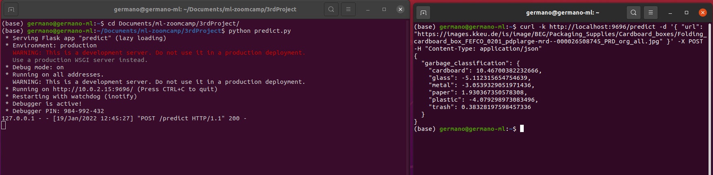
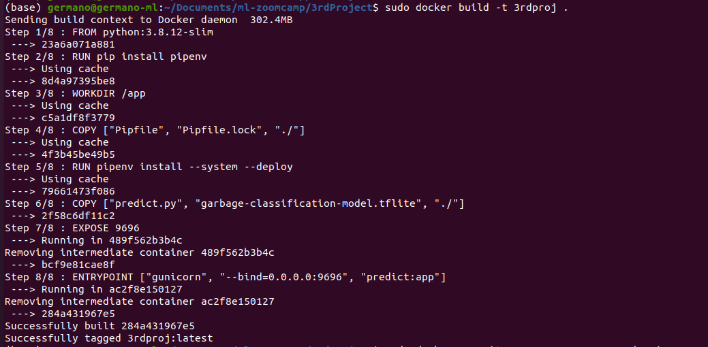
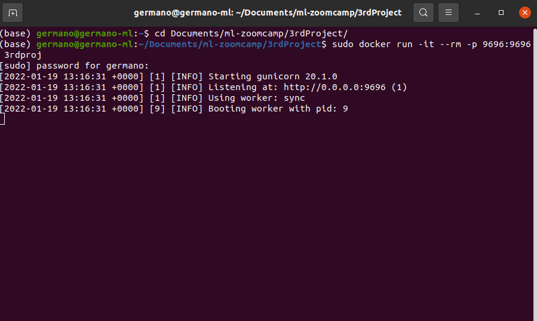
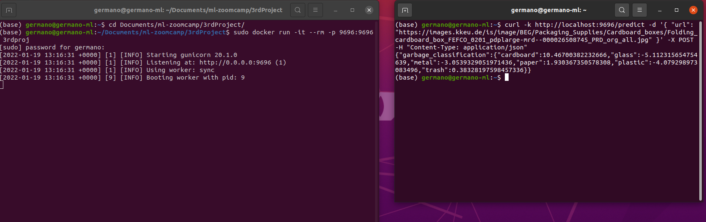

# ML 3rd Project - Garbage Classification

# Summary
1. Problem Description
2. EDA
3. Dataset preparation
4. Model Training and tuning
5. Evaluating models score and train the final model
6. Exporting notebook to script
7. Model deployment and test with Flask
8. Dependency and enviroment management
9. Containerization

## Package Files description
This package contain the following files:
1. 3rdproj.ipynb: The jupiter notebook with the Analysis, EDA, tested models, tuning and training
2. Pipfile and Pipfile.lock: Pipenv files for the virtual environment
3. Dockerfile: Docker configuration file
4. train.py: the python script responsible for training and generate multiple models (you can choose the best)
5. garbage-classification-model.tflite: model
6. convert.py: specify the model file you can convert the .h5 model to tflite model format
7. predict.py: Starts the service with Flask, after that you can send the curl requests 
8. Garbage classification.zip: the dataset from Kaggle (compressed and subdivided in train and validation)
9. README.md: this file with the instruction.
10. Screenshots Folder: contain the screenshot included in README.md file

## 1. Problem Description
In my first project I did experiments about regression model, in the second one about classification of data and in this last one I would try classification of images using tensorflow and keras.
Doing this project I had a review of the Lessons 8 of ml zoomcamp course.

Here the link of the dataset I use:
	https://www.kaggle.com/asdasdasasdas/garbage-classification

The goal is to buil a model who receive a garbage image and classify it as cardboard or glass or metal or paper or plastic or trash.

As said before there are six classes of garbage:
1. Cardboard (403 images)
2. Glass (501 images)
3. Metal (410 images)
4. Paper (594 images)
5. Plastic (482 images)
6. Trash (137 images)

## 2. EDA
Before preparing the dataset for the training I did some experiments on loading the images and review them in order to understand if they are good or not.
For example I checked if the images are centered, if they are cutted etc.
I notice there are many logos or writing and this recall me the dropout technique, very useful when you work with these kind of data. 

## 3. Dataset preparation
I use a pre-trained model (Xception) using imagenet dataset
For the project I subdivided the dataset as follow:
1. Cardboard (322 images for train and 81 for validation)
2. Glass (400 images for train and 101 for validation)
3. Metal (328 images for train and 82 for validation)
4. Paper (475 images for train and 119 for validation)
5. Plastic (385 images for train and 97 for validation images)
6. Trash (109 images for train and 28 for validation)

## 4. Model Training and tuning
After completing the dataset as described before I prepare a clean training function without the top layer (I used Xception model with pre-training dataset from imagenet)
I worked only on convolutional layers.
I perform these following steps:
1. Only one dense layer (6 classes, softmax activation), train the model using multiple learning rate parameters for 10 epochs
2. When I found out the right learning rate parameter, I add a further dense layer of range set by parameter, and for every parameter I train the model for 10 epochs
3. When I finished adjusting the parameter for the new dense layer, I worked on dropout and regularization. I trained the model with the previous parameters and with a set of dropout values (until   	  50%) for more epochs (20)
4. Finally I had some tries using data augmentation  
5. I had some time to test and train using ResNet50V2 instead of Xception

## 5. Evaluating models score and train the final model
For every step of training and tuning I collected training and validation accuracy and loss
I noticed improvements using learning_rate and dropout regularization, but I was disappointed of data augmentation.
At the end I trained the final model without data augmentation, but I training the model with the other parameters for more epoch (50).
The best result I obtained was 82.7 accuracy. I use as final model the one with 82.1 accuracy because with less data loss value.
Using ResNet50V2 and data augmentation I got a 0.846 accuracy model (size 283mb). Since the small accuracy difference and the size I still prefer using the previous model.
I hoped in something better, but I stop the test there because of time and another important factor: I worked on virtual machine with only CPU power. It took more than an hour for processing 10 epochs. Some training session last even 6 hours with a burning cpu ....

## 6. Exporting notebook to script
The Jupiter Notebook was exported in Python.
Built train.py script.
train.py script read the dataset csv file, train the model using the Garbage classification.zip (previously extracted) dataset and generate more tha one .h5 model.
After that you can choose the best model by accuracy (you find the parameter on the file name) and use the script convert.py to trasform into tflite model (See part 7)

## 7. Model deployment and test with Flask
During the training and tuning sessions I used the checkpointing function so I have the .h5 model ready.
Before using it I converted it in order to use tflite, so we have out garbage-classification-model.tflite model file ready to use.

You can test the model with Flask using:
* predict.py

predict.py is responsible to receive a image of garbage, use the model to classify it and return a score for every classes. The debug services use Flask and stay in alert if a job_post request has submitted.

1. The fastest method to test with Flask is to use the garbage-classification-model.tflite already included in the package (the model file should stay in the same directory of predict.py):
	* Open a linux terminal and go to the folder of the model and script
	* Run the following command: python predict.py -> The Flask service starts and waits for request
	* Send a request (image to the service) with the following command: curl -k http://localhost:9696/predict -d '{ "url": "https://images.kkeu.de/is/image/BEG/Packaging_Supplies/Cardboard_boxes/Folding_cardboard_box_FEFCO_0201_pdplarge-mrd--000026508745_PRD_org_all.jpg" }' -X POST -H "Content-Type: application/json" where the parameter "url": "https://images.kkeu.de/is/image/BEG/Packaging_Supplies/Cardboard_boxes/Folding_cardboard_box_FEFCO_0201_pdplarge-mrd--000026508745_PRD_org_all.jpg" is the url of an image from google. You can try with different images.

2. I prefer to include all the file to the project in order to avoid to get more complicated the scripts.
	* Decompress Garbage classification.zip -> You get the dataset subdivided to train and validation
	* In the same folder you need train.py script with train the model and generate more than one model because checkpointing is set.
	  Be careful on this part because if you don't have a CPU with the AVX support tensorflow doesn't work.
	  I generated the model from jupyter notebook and anaconda env configuring a conda env with python 3.7 and all the necessary library
	* When you have the models, you can choose among them which is the best and converting it in tflite using the convert.py script
	  in the script you have to substitute the name of the .h5 model (es. line: model = keras.models.load_model('./xception_v2_06_0.821.h5')) with the one you have choose and run the script -> python convert.py
	

	

## 8. Dependency and enviroment management
In this part I prepare the pipenv virtual environment with all the necessary package to use our model

This is the command I used: 
	pipenv install numpy pandas scikit-learn==0.24.1 flask gunicorn requests tensorflow tflite tflite_runtime keras_image_helper

IMPORTANT: Using my virtual machine I got problem installing some package like tensorflow due to timeout
To cope with this problem, before running the pipenv install command I set the following enrvironment variable:
	export PIPENV_INSTALL_TIMEOUT=9000

In other word I prevent the timeout setting this parameter to higher level.

This step generate the PIPENV files (Pipfile and Pipfile.lock) used in the next step to build the Docker image

## 9. Containerization
I used python:3.8.12-slim a light version with python 3.8
You can pull the image with the following command: sudo docker pull python:3.8.12-slim
And run the image with the following command: sudo docker run -it --rm --entrypoint=bash python:3.8.12-slim

I prepared a Dockerfile to build the image with all the necessary for the service:

> FROM python:3.8.12-slim

> RUN pip install pipenv

> WORKDIR /app

> COPY ["Pipfile", "Pipfile.lock", "./"]

> RUN pipenv install --system --deploy

> COPY ["predict.py", "garbage-classification-model.tflite", "./"]

> EXPOSE 9696
> ENTRYPOINT ["gunicorn", "--bind=0.0.0.0:9696", "predict:app"]

To summarize, the script download the clean imange, install the packages listed in Pipfiles, prepare the pip virtual environment, copy the model called garbage-classification-model.tflite and the service script, expose and run the service using gunicorn

Here the command to build the Docker Container: sudo docker build -t 3rdproj .
(. stand for I execute the command on the same folder I have the Dockerfile)

Here the command to run the Docker image and start the service: sudo docker run -it --rm -p 9696:9696 3rdproj
3rdproj is the name of the image I set before

And finally a request for our service using the same command as before
Open a terminal and paste this command: curl -k http://localhost:9696/predict -d '{ "url": "https://images.kkeu.de/is/image/BEG/Packaging_Supplies/Cardboard_boxes/Folding_cardboard_box_FEFCO_0201_pdplarge-mrd--000026508745_PRD_org_all.jpg" }' -X POST -H "Content-Type: application/json" where the parameter "url": "https://images.kkeu.de/is/image/BEG/Packaging_Supplies/Cardboard_boxes/Folding_cardboard_box_FEFCO_0201_pdplarge-mrd--000026508745_PRD_org_all.jpg" is the url of an image from google. You can try with different images.

In the notepad, and you can test also here I tried the following image got from google image:

For cardboard:
https://images.kkeu.de/is/image/BEG/Packaging_Supplies/Cardboard_boxes/Folding_cardboard_box_FEFCO_0201_pdplarge-mrd--000026508745_PRD_org_all.jpg

For plastic:
https://encrypted-tbn0.gstatic.com/images?q=tbn:ANd9GcSJm0EULF8I8upx-gcOQQ6OgEMb0Wy5q3pc7g&usqp=CAU

For glass:
https://encrypted-tbn0.gstatic.com/images?q=tbn:ANd9GcSXiQMh90X7I5lRslSReaFY0RCvGU-jMPAnsA&usqp=CAU

